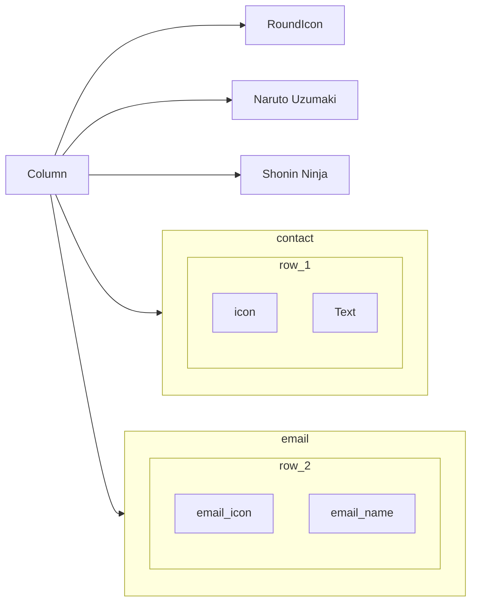
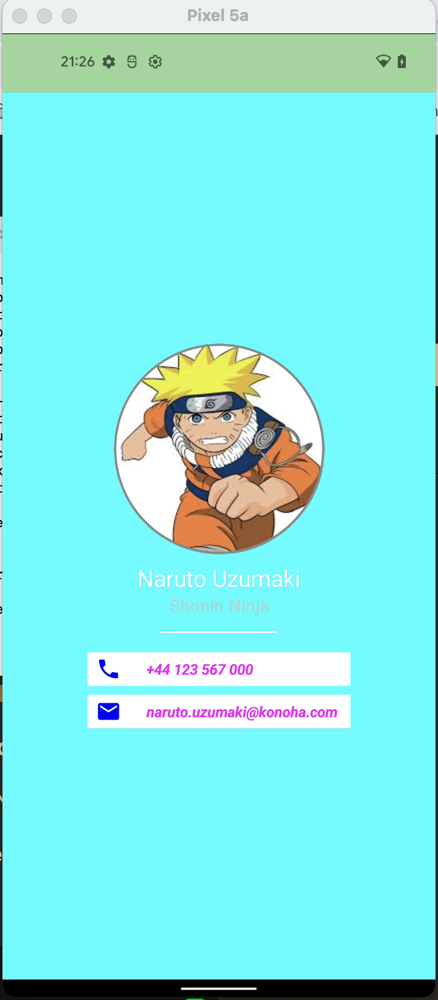

# Micard
* This is very simple practice with compose.
* The UI including column, and one compose function to build the box with icon and text.

## 1. The UI Structure

## 2. Create Circle Image by applying path
```kotlin
 // Profile image with Circle Boundary
        Image(
            painter = painterResource(id = R.drawable.naruto_profile),
            contentDescription = "profile",
            contentScale = ContentScale.FillBounds,
            modifier = Modifier
                .clip(CircleShape)
                .size(200.dp)
                .border(2.dp, Color.Gray, CircleShape)
        )
```
## 3. The result
